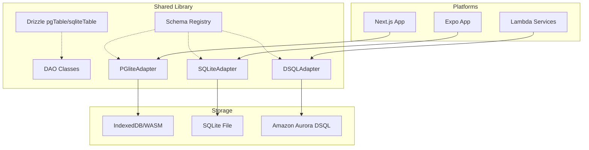

# TDD - Armoury Drizzle Data Layer Rearchitecture

| Field           | Value                                      |
| --------------- | ------------------------------------------ |
| Tech Lead       | @Antigravity                               |
| Product Manager | @ArmouryOwner                              |
| Team            | Data Platform Team                         |
| Epic/Ticket     | ARM-001-DRIZZLE-DATA-LAYER                 |
| Status          | Approved                                   |
| Created         | 2026-02-21                                 |
| Last Updated    | 2026-02-21                                 |

## Context

Armoury is a TypeScript monorepo designed for managing tabletop game army data across multiple platforms, including web, mobile, and serverless Lambda functions. The system relies on Amazon Aurora DSQL for its primary production database, with local persistence requirements on mobile devices and within the browser for offline capability.

Currently, the data layer suffers from fragmentation, with three distinct and inconsistent adapter implementations and a lack of a unified migration system. This fragmentation leads to duplicated logic, maintenance overhead, and production risks due to entity registration gaps between the shared library and platform-specific services.

The goal of this project is to unify the data layer around Drizzle ORM across all platforms, ensuring a single source of truth for schemas colocated with their respective Data Access Objects (DAOs). This rearchitecture will also introduce a comprehensive end-to-end (E2E) test suite to ensure the entire backend is air-tight, covering every adapter, service, and game system plugin without mocking.

## Problem Statement & Motivation

### Problems We're Solving

- **Fragmented Database Adapters**: Three separate implementations (DSQL, SQLite, IndexedDB) with inconsistent CRUD logic, JSON serialization, and mapping. This results in significant code duplication and increased bug surface area across Lambda services.
- **Missing Migration System**: Table creation relies on 'CREATE TABLE IF NOT EXISTS' at runtime or manual assumptions about existence. There is no versioned, reviewable migration history, leading to configuration drift between environments.
- **Entity Registration Gaps**: Lambda services use the shared DSQLAdapter but often fail to register service-specific entities. This causes runtime errors in production when the adapter attempts to access unknown tables.
- **Lack of Integration Testing**: Testing currently relies on mocks, leaving the actual database interactions and service-to-service communication unverified. This has resulted in regressions in WebSocket functionality and DataContext building.

### Why Now?

- **Scalability and Maintenance**: As more game systems and services are added, the current fragmented approach becomes unsustainable and prone to errors.
- **Reliability Requirements**: The move to Amazon Aurora DSQL and the addition of complex campaign features require a robust, type-safe data layer with verified migration paths.
- **Developer Velocity**: A unified Drizzle-based approach with automated migrations and comprehensive tests will significantly reduce the time spent debugging database issues and manually verifying changes.

### Impact of NOT Solving

- **Business**: Continued risk of production outages due to schema mismatches or missing tables in Lambda services.
- **Technical**: Accumulation of technical debt as divergent adapter implementations continue to evolve separately.
- **Users**: Potential data loss or corruption on mobile/web due to unverified local migration paths or inconsistent serialization logic.

## Scope

### ✅ In Scope (V1 - MVP)

- Refactor DSQLAdapter to use Drizzle ORM for all operations.
- Implement new PGliteAdapter for browser-side persistence, replacing Dexie/IndexedDB.
- Refactor SQLiteAdapter to use drizzle-orm/expo-sqlite for mobile persistence.
- Implement DAO-colocated schemas where pgTable definitions reside in DAO files.
- Establish a unified migration flow using drizzle-kit for PostgreSQL and SQLite dialects.
- Fix service-specific entity registration via registerSchemaExtension().
- Create a comprehensive E2E test suite using PGlite for Node.js-based database testing.
- Implement serverless-offline test harness for full service E2E verification.

### ❌ Out of Scope (V1)

- Migrating existing legacy data in user-local IndexedDB (clean start for PGlite).
- Advanced database performance tuning beyond standard indexing.
- Cross-region database replication testing (handled by AWS Aurora DSQL infra).

### 🔮 Future Considerations (V2+)

- Implementation of a data sync protocol between PGlite (local) and DSQL (remote).
- Automated performance regression testing in the E2E pipeline.
- Support for additional SQL dialects if expanding beyond PostgreSQL/SQLite.

## Technical Solution

### Architecture Overview

The new architecture centers on Drizzle ORM as the unified interface for all database interactions. Schemas are defined once using Drizzle's DSL and colocated with the DAOs that use them.

**Key Components**:

- **Drizzle ORM**: The core library providing type-safe SQL construction and mapping.
- **drizzle-kit**: Tooling for schema scanning, diffing, and migration generation.
- **PGlite**: WASM-based PostgreSQL for browser persistence and Node.js testing.
- **Adapters**: Refactored DSQLAdapter (Lambda), SQLiteAdapter (Mobile), and PGliteAdapter (Web).
- **Schema Registry**: A centralized shared utility that gathers all registered table definitions for adapter initialization.

**Architecture Diagram**:



### Data Flow

1. **Schema Definition**: Developer defines or updates a table using `pgTable` in a shared DAO file.
2. **Migration Generation**: `drizzle-kit generate` scans the DAOs and creates a SQL migration file in the `drizzle/` directory.
3. **Migration Application**:
    - Lambda (Aurora DSQL): `drizzle-kit migrate` runs at **deploy time** (CI/CD step), NOT at adapter initialization. This avoids cold start penalties.
    - Web (PGlite): Programmatic `migrate()` at PGliteAdapter initialization (no deploy step for browser databases).
    - Mobile (expo-sqlite): Programmatic `migrate()` at SQLiteAdapter initialization (no deploy step for local databases).
4. **Data Access**: DAOs use the unified DatabaseAdapter interface, which now delegates to Drizzle-based drivers instead of raw SQL builders.

### APIs & Endpoints

While this TDD focuses on the data layer, it affects the internal service "APIs" (the DatabaseAdapter interface).

| Method | Description | Implementation Detail |
| ------ | ----------- | --------------------- |
| `put(entity, data)` | Inserts or updates a record | Uses Drizzle `.insert().onConflictUpdate()` |
| `get(entity, id)` | Retrieves a record by ID | Uses Drizzle `.select().where(eq(id))` |
| `getAll(entity, options)` | Lists records with pagination | Uses Drizzle `.select().limit().offset()` |
| `transaction(cb)` | Executes a block in a transaction | Uses Drizzle native transaction support |

### Database Changes

Every entity will now have an explicit Drizzle table definition colocated in its DAO file.

**Example: CampaignDAO.ts**
```typescript
import { pgTable, text } from 'drizzle-orm/pg-core';
import type { DatabaseAdapter } from '@armoury/data';
import type { Campaign } from '@armoury/models';
import { BaseDAO } from '@armoury/data';

export const campaignsTable = pgTable('campaigns', {
    id: text('id').primaryKey(),
    name: text('name').notNull(),
    startDate: text('start_date').notNull(),
    endDate: text('end_date'),
    campaignTypeId: text('campaign_type_id').notNull(),
    createdAt: text('created_at').notNull(),
    updatedAt: text('updated_at').notNull(),
});

export class CampaignDAO extends BaseDAO<Campaign> {
    public constructor(adapter: DatabaseAdapter) {
        super(adapter, 'campaign');
    }
}
```

#### Full Entity Inventory

**Core Entities** (shared/data/dao/) — move pgTable defs from dsql/schema.ts into each DAO:

NOTE: `faction` is NOT a core entity. It is game-system-specific (BSData catalog references) and belongs in the wh40k10e plugin.

| Entity Store | DAO | Table | Key Columns |
|-------------|-----|-------|-------------|
| fileSyncStatus | (no class, table-only export) | sync_status | file_key PK, sha, last_synced, etag |
| account | AccountDAO | accounts | id PK, display_name, first_name, last_name, nickname, picture, email, email_verified (bool), linked_providers (jsonb), preferences (jsonb), last_sync_at, created_at, updated_at |
| friend | FriendDAO | friends | id PK, requester_id, receiver_id, status, requester_name, requester_picture, receiver_name, receiver_picture, can_share_army_lists (bool), can_view_match_history (bool), created_at, updated_at. Indexes: requester_id, receiver_id |
| userPresence | UserPresenceDAO | user_presence | user_id PK, connection_id, status, last_seen |
| match | MatchDAO | matches | id PK, system_id, player_ids (jsonb or separate columns TBD), result, match_data (jsonb — system-specific payload), played_at, created_at, updated_at |
| campaign | CampaignDAO | campaigns | id PK, name, start_date, end_date, campaign_type_id, created_at, updated_at |
| campaignParticipant | CampaignParticipantDAO | campaign_participants | campaign_id + user_id (composite PK), synthetic id = campaignId:userId |
| campaignType | CampaignTypeDAO | campaign_types | id PK, name, source |
| customCampaign | CustomCampaignDAO | custom_campaigns | id PK, phases (jsonb) |

Key design decisions:
- **Match is a core entity** with a `matchData` JSONB field for game-system-specific data. Each game system defines the shape of its match data (e.g., 40k has roundScores, armyHPState, gameTracker). The core Match entity is system-agnostic.
- **UserPresence is a core entity**, not service-local. Online presence is a cross-cutting concern.
- **Faction is NOT core** — it is BSData-specific and belongs in the wh40k10e plugin.

**40K System Entities** (systems/wh40k10e/dao/) — registered via plugin `registerSchemaExtension()`:

| Entity Store | DAO | Table | Key Columns |
|-------------|-----|-------|-------------|
| faction | Wh40kFactionDAO | factions | id PK, name, source_file, source_sha, catalogue_file |
| wh40kSystemCampaign | Wh40kSystemCampaignDAO | wh40k_system_campaigns | id PK, crusade_rules_id, phases (jsonb) |
| masterCampaign | Wh40kCampaignDAO | master_campaigns | id PK, name, organizer_id, status, start_date, end_date, battle_size, points_limit, crusade_rules_id, created_at, updated_at |
| participantCampaign | (40k system) | participant_campaigns | id PK, campaign_id, user_id, army_id, crusade_points, supply_limit, requisition_points, battles_won/lost/drawn, created_at, updated_at |
| army | Wh40kArmyDAO | armies | id PK, user_id, faction_id, name, points, units (jsonb), detachments (jsonb), created_at, updated_at |

NOTE: The existing `matchRecord` entity in the 40k system should be refactored. Match records are now core entities. The 40k-specific match data (roundScores, armyHPState, gameTracker, etc.) becomes the `matchData` JSON payload in the core Match entity.

**Service Entities** (registered via `registerSchemaExtension()` at service startup):

| Entity Store | Service | Table | Key Columns |
|-------------|---------|-------|-------------|
| wsConnection | matches | ws_connections | connection_id PK, user_id, connected_at |
| matchSubscription | matches | match_subscriptions | id PK (connectionId:matchId), connection_id, match_id, user_id |

**Migration Strategy**:

- **Initial State**: All existing tables defined in Drizzle pgTable within their DAO files.
- **Initial Migration**: `drizzle-kit generate` creates a baseline migration covering all tables.
- **Future Changes**: Developers modify pgTable definitions, then `drizzle-kit generate` diffs and produces versioned SQL in `drizzle/`.
- **Dialect Support**: DSQL and PGlite share PostgreSQL pgTable definitions. SQLiteAdapter uses separate sqliteTable definitions (Phase 4).

## Risks

| Risk | Impact | Probability | Mitigation |
|------|--------|-------------|------------|
| PGlite Bundle Size | Medium | High | Lazy-load PGlite module and WASM binary only when needed. |
| Schema Desync | High | Low | CI check to ensure migrations are up to date with schema files. |
| Dialect Inconsistency | Medium | Medium | Maintain parallel schemas or use a shared abstraction for common fields. |
| Migration Failure | High | Low | Transactional migrations; comprehensive E2E testing of the migration runner. |
| Performance of WASM SQL | Medium | Medium | Use PGlite persistence optimizations; monitor query latency in browser. |

## Implementation Plan

### Phase 1: DAO-Colocated Schemas & Tooling
- Move all table definitions into respective DAO files using `pgTable`.
- Configure `drizzle.config.ts` to scan the monorepo for these definitions.
- Generate the initial baseline migration SQL.
- Refactor the shared `DSQLAdapter` to use Drizzle's `node-postgres` driver.

### Phase 2: Web & Mobile Adapter Refactor
- Implement `PGliteAdapter` for the web workspace.
- Replace Dexie/IndexedDB dependency with `@electric-sql/pglite`.
- Refactor `SQLiteAdapter` in the shared workspace to use `drizzle-orm/expo-sqlite`.
- Implement programmatic migration runners for both platforms.

### Phase 3: Service Alignment (Option A — Schema Extensions)
- Add `schema.ts` to each Lambda service (matches, friends, campaigns) to register service-specific entities via `registerSchemaExtension()`.
- This follows the same mechanism the wh40k10e plugin uses, keeping services consistent with the plugin architecture.
- Remove redundant `local-adapter.ts` implementations from services.
- Services now use the shared `DSQLAdapter` for all environments (production uses Aurora DSQL, local dev uses PGlite or local PostgreSQL).
- Ensure all service handlers import their schema extensions as a side-effect at the top of `handler.ts`, before adapter initialization.

### Phase 4: E2E Test Suite Development
- Setup PGlite-based test infrastructure for Node.js.
- Implement integration tests for every DAO and adapter.
- Setup `serverless-offline` harness for full service testing.
- Implement WebSocket client tests for real-time features.

## Security Considerations

### Authentication & Authorization

- **Database Access**: Aurora DSQL uses IAM authentication for Lambda functions.
- **Data Isolation**: All queries must include a `userId` check where applicable (Tenant isolation).
- **Injection Prevention**: Drizzle ORM uses parameterized queries by default, mitigating SQL injection risks.

### Data Protection

- **Encryption at Rest**: Handled by Amazon Aurora DSQL and native mobile encryption.
- **In Transit**: All connections to DSQL use TLS.
- **PII Handling**: User emails and nicknames are stored. Database access is restricted to the specific Lambda execution roles.

### Compliance Requirements

- **GDPR**: The E2E suite will include tests for data deletion flows (AccountDAO.delete).
- **Secrets**: No database credentials or API keys are stored in the repository; all are retrieved from environment variables via AWS Secrets Manager.

## Testing Strategy

All tests use real databases and real services. No mocking of database adapters, HTTP clients, or WebSocket connections.

### Test Infrastructure

| Component | Technology | Purpose |
| --------- | ---------- | ------- |
| PostgreSQL (test) | PGlite in Node.js (`new PGlite()`) | In-memory PostgreSQL for adapter/DAO/DataContext tests |
| Lambda (test) | serverless-offline as child process | Local Lambda runtime for service E2E tests |
| WebSocket (test) | `ws` npm package | WebSocket client for WS E2E tests |
| Test Runner | Vitest | All test categories |
| Port Assignments | matches: http 3001, ws 3002; friends: http 3004, ws 3005; campaigns: http 3007 | Service isolation |

### Test Setup Pattern

```typescript
import { PGlite } from '@electric-sql/pglite';
import { drizzle } from 'drizzle-orm/pglite';
import { migrate } from 'drizzle-orm/pglite/migrator';

let pg: PGlite;
let db: DrizzleDatabase;

beforeAll(async () => {
    pg = new PGlite(); // in-memory PostgreSQL
    db = drizzle(pg);
    await migrate(db, { migrationsFolder: './drizzle' });
});

afterAll(async () => {
    await pg.close();
});
```

### 1. Adapter Integration Tests (`src/shared/e2e/adapters/`)

Test each adapter against a real database. For each adapter, verify:
- `initialize()` creates all expected tables
- `get`/`put`/`delete`/`getAll`/`getByField`/`deleteByField`/`count` for every entity type in CoreEntityMap
- `putMany` batch operations
- `transaction` rollback on error
- `getSyncStatus`/`setSyncStatus`/`deleteSyncStatus`
- `QueryOptions` (limit, offset, orderBy asc/desc)

Adapters to test:
- DSQLAdapter against PGlite (same PostgreSQL dialect as Aurora DSQL)
- PGliteAdapter against PGlite with `idb://` persistence (browser env or jsdom)

### 2. DAO Integration Tests (`src/shared/e2e/dao/`)

Test every DAO method against a real PGlite adapter:
- **AccountDAO**: get, list, save, delete, count
- **FriendDAO**: get, list, save, delete, listByStatus
- **CampaignDAO**: get, list, save, delete, listByType
- **CampaignParticipantDAO**: listByCampaign, listByUser, composite key behavior
- **CampaignTypeDAO**: listBySource
- **CustomCampaignDAO**: save/get with JSON phases field, verify JSONB round-trip
- **Wh40kSystemCampaignDAO**: listByCrusadeRules, verify JSONB round-trip
- **Wh40kCampaignDAO**: listByOrganizer, listByStatus
- **Wh40kArmyDAO**: CRUD with nested JSONB fields
- **Wh40kMatchDAO**: CRUD with complex JSONB (roundScores, armyHPState, gameTracker)

### 3. DataContext Integration Tests (`src/shared/e2e/datacontext/`)

Build a real DataContext with the wh40k10e plugin against PGlite:
- `DataContext.builder().system(wh40k10eSystem).build()` succeeds
- All DAO accessors return working DAO instances
- Plugin schema extensions are registered (40k tables exist)
- Entity CRUD through DataContext DAOs works end-to-end

### 4. Schema Extension Tests (`src/shared/e2e/schema/`)

- Register core schema -> verify core tables exist
- Register plugin schema -> verify plugin tables exist alongside core
- Register service schema -> verify service tables exist alongside core + plugin
- Verify entity store resolution works for all registered entities
- Verify unknown entity store throws appropriate error

### 5. Service E2E Tests (`src/services/{service}/e2e/`)

For each service (matches, friends, campaigns):
- Start serverless-offline as a child process (beforeAll)
- Run HTTP requests against REST endpoints using `fetch`
- Verify CRUD operations return correct response shapes
- Verify auth token validation (401 without token, 200 with valid token)
- Verify error handling (404 for missing entities, 400 for invalid input)
- Graceful shutdown of serverless-offline (afterAll)

For WebSocket services (matches, friends):
- Connect via `ws` client with auth token in query string
- Verify `$connect` stores connection record
- Verify `$disconnect` cleans up connection and subscriptions
- Verify message routing ($default returns 400, named routes work)
- **Matches WS**: updateMatch broadcasts to subscribers, subscribeMatch sends current state, unsubscribeMatch removes subscription
- **Friends WS**: connect sets online + notifies friends, disconnect sets offline + notifies friends
- Verify stale connection cleanup (410 Gone handling)
- Verify concurrent connections and subscriptions

### 6. Client Integration Tests (`src/shared/e2e/clients/`)

- **GitHub client**: Test against real GitHub API (BSData/wh40k-10e repo) — list files, get file content, check rate limits. Use environment variable for API token. Skip in CI if no token.
- **Wahapedia client**: Test scraping if applicable (or skip if not used).

### 7. Migration Tests (`src/shared/e2e/migrations/`)

- Apply all migrations to a fresh PGlite instance
- Verify every expected table exists with correct column names and types
- Insert and query sample data for each table
- Test migration idempotency (apply twice, second run is no-op)
- Test migration ordering (apply in sequence, verify intermediate states)

## Monitoring & Observability

### Metrics to Track
- **Query Latency**: p95 and p99 durations for all database operations via Drizzle hooks or adapter logging.
- **Migration Success Rate**: Logs for every successful or failed migration attempt in production.
- **Connection Health**: Pool exhaustion or connection failures in DSQLAdapter.

### Structured Logging
Logs will follow the standard JSON format:
```json
{
  "level": "info",
  "timestamp": "ISO8601",
  "message": "Database operation complete",
  "context": {
    "entity": "matchRecord",
    "operation": "put",
    "duration_ms": 12
  }
}
```

## Rollback Plan

### Database Rollback
- **Mechanism**: `drizzle-kit` generated 'down' migrations.
- **Trigger**: Any migration failure during deployment or critical error rate increase (>5%) post-deploy.
- **Steps**:
    1. Revert application code to previous stable version.
    2. Run the corresponding down migration SQL via a manual administrative task if automated rollback is not possible.

### Feature Rollout
- **Canary**: Deploy Lambda changes to a subset of traffic first.
- **Monitoring**: Close observation of Sentry error rates and DSQL latency metrics during rollout.

## Success Metrics

| Metric | Baseline | Target |
| ------ | -------- | ------ |
| Code Duplication (Adapter Logic) | High | Zero (Unified Shared Logic) |
| Test Coverage (Data Layer) | < 20% | > 90% |
| Service Runtime Failures (Unknown Entity) | Occasional | Zero |
| Migration Review Time | High (Manual) | Low (SQL Diff Review) |

## Glossary & Domain Terms

| Term | Description |
| ---- | ----------- |
| **DSQL** | Amazon Aurora DSQL (PostgreSQL-compatible serverless database). |
| **PGlite** | Lightweight WASM-based PostgreSQL for local and test use. |
| **DAO** | Data Access Object, encapsulates database logic for a specific entity. |
| **Adapter** | Implementation of the DatabaseAdapter interface for a specific platform. |
| **Entity Store** | The mapping of an entity name (e.g., 'account') to its physical table. |

## Alternatives Considered

| Option | Pros | Cons | Why Not Chosen |
| ------ | ---- | ---- | -------------- |
| **Prisma** | Excellent DX, typed client. | Large bundle size, not ideal for WASM/Mobile. | Too heavy for mobile/browser platforms. |
| **TypeORM** | Mature, feature-rich. | Heavy reflection, complex migrations. | Drizzle offers better performance and lighter weight. |
| **Kysely** | Pure SQL builder, very light. | No built-in migration system or WASM driver. | Drizzle provides a better holistic ecosystem for migrations. |

## Dependencies

| Dependency | Type | Purpose |
| ---------- | ---- | ------- |
| **Drizzle ORM** | Core | Schema definition and query building. |
| **PGlite** | Core | Browser storage and E2E testing. |
| **drizzle-kit** | Tooling | Migration generation and management. |
| **serverless-offline** | Testing | Local Lambda and WebSocket simulation. |

## Performance Requirements

- **Initialization**: Database and PGlite initialization should complete in < 500ms on web/mobile.
- **Query Latency**: Local queries (PGlite/SQLite) should have p95 < 20ms.
- **Migration Time**: Migrations should apply in < 5 seconds for standard schema updates.

## Migration Plan

1. **Schema Audit**: Catalog all existing manual table definitions.
2. **Phase 1 Deployment**: Deploy Drizzle-based DSQLAdapter alongside existing logic (Feature Flagged).
3. **Data Verification**: Run dual-write or verification scripts in production to ensure Drizzle output matches legacy output.
4. **Full Cutover**: Switch all services and platforms to the new adapters.
5. **Cleanup**: Remove legacy adapter code and IndexedDB persistence logic.

## Decisions Made

| Decision | Choice | Rationale |
| -------- | ------ | --------- |
| Service entity approach | Option A: Schema Extensions | Services register entities via `registerSchemaExtension()`, same mechanism as plugins. Maintains consistency across the codebase. |
| Schema colocation | DAO-colocated `pgTable` definitions | Each DAO file exports its Drizzle table definition alongside the class. Single source of truth per entity. |
| IndexedDB replacement | PGlite with `idb://` persistence | PostgreSQL-compatible WASM build enables shared schema with Aurora DSQL. |

## Open Questions

1. **Composite Keys**: How will `BaseDAO` be extended to support entities like `campaignParticipant` with composite primary keys? The synthetic `id` field (campaignId:userId) is a workaround — should BaseDAO support real composite PKs?
2. **Local Dev Storage**: Should local development for services default to PGlite (no Docker needed) or a Docker-based PostgreSQL (closer to production)?
3. **Migration Strategy for Mobile**: Should mobile app updates force a migration on every startup or only when the app version increases?
4. **Browser Database Versioning**: Should PGlite (browser) migrations be kept in lockstep with Aurora DSQL, or versioned separately?
5. **drizzle-kit Schema Scanning**: Should `drizzle.config.ts` use a glob pattern (`./src/**/dao/**/*.ts`) or an explicit file list for schema paths?

## Roadmap / Timeline

| Milestone | Deliverable | Target Date |
| --------- | ----------- | ----------- |
| **M1** | Phase 1 (Core Drizzle + DSQL) | Week 1 |
| **M2** | Phase 2 (PGlite + SQLite) | Week 2 |
| **M3** | Phase 3 (Service Integration) | Week 3 |
| **M4** | Phase 4 (Full E2E Test Suite) | Week 4 |
| **M5** | Final Verification & Production Cutover | Week 5 |

## Approval & Sign-off

| Role | Name | Status | Date |
| ---- | ---- | ------ | ---- |
| Tech Lead | @Antigravity | Approved | 2026-02-21 |
| Product Manager | @ArmouryOwner | Pending | - |
| Lead Developer | @MainDev | Pending | - |

**Approval Criteria**:
- All mandatory sections complete and reviewed.
- Migration path for all three platforms verified.
- E2E test harness proven effective for WebSocket testing.
